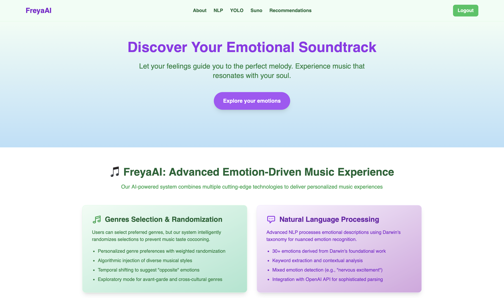
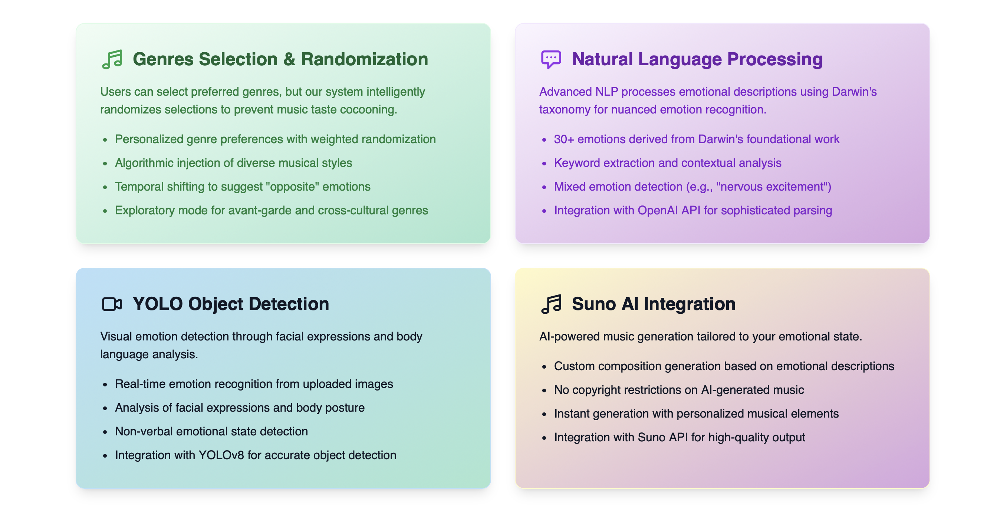

# 🎵 FreyaAI: Advanced Emotion-Driven Music Experience



<p align="center"><em><b>FreyaAI home page UI</b></em></p>

**Abstract**  
FreyaAI is an innovative web application designed to help users navigate and manage their emotions through personalized music experiences. Leveraging Spotify's API, OpenAI's natural language processing (NLP) capabilities, computer vision with YOLO object detection, and Suno AI's music generation, the system analyzes a user's emotional state through multiple inputs and generates tailored playlists or even custom compositions. The system uses a refined taxonomy of 30+ emotions—inspired by Charles Darwin's foundational work on emotional expression—and implements strategies to prevent filter bubbles in music discovery.

---

## 🚀 1. Introduction  

Existing music recommendation systems often rely on oversimplified emotional models or generic genre-based classifications, failing to address nuanced emotional needs. FreyaAI bridges this gap by:  
- **Expanding emotional granularity**: Incorporating 30+ emotions derived from Darwin's *The Expression of the Emotions in Man and Animals* (1872).  
- **Multi-modal emotion detection**: Supporting text-based NLP analysis, real-time facial/body language detection with YOLO, and manual selection.  
- **AI-powered music creation**: Integrating with Suno AI to generate custom compositions based on emotional descriptions.  
- **Personalized genre preferences**: Allowing users to select preferred genres to influence recommendations.  
- **Diverse recommendations**: Combining audio features with popularity metrics to balance familiarity and novelty.  



---

## ⚙️ 2. System Architecture  

The application follows a modern full-stack architecture with the following components:  
```plaintext
FreyaAI/
├── Backend (Python/Flask): API endpoints, emotion analysis, Spotify/Suno API integrations  
├── Frontend (Next.js/React/Tailwind CSS): Interactive UI with responsive design  
├── AI Integration: 
│   ├── OpenAI API: NLP-based emotion classification  
│   ├── YOLO Model: Real-time emotion detection from camera input  
│   └── Suno API: AI-powered music generation  
├── Database: SQLite database storing user preferences and emotion-genre mappings  
└── Authentication: Spotify OAuth 2.0 integration  
```  

Key dependencies:  
- **Spotify Web API**: For track search, audio feature extraction, and playlist generation.  
- **OpenAI API**: To parse user-generated text into discrete emotional states.  
- **Suno API**: To generate custom music compositions based on textual prompts.  
- **YOLO Model**: For real-time emotion detection from camera input.  

---

## 🧠 3. Emotion Identification  

### 3.1 Theoretical Foundation  
Darwin's work established that emotions are universal, biologically rooted, and expressed through consistent physical cues (e.g., facial expressions, posture). FreyaAI adapts his taxonomy to modern affective computing by:  
- **Including compound emotions**: E.g., "Tender feelings" (a blend of love and calm) or "Dejection" (low-intensity sadness).  
- **Mapping emotions to physiological responses**: E.g., "Blushing" (linked to shyness/modesty) informs acoustic features like tempo (slower for self-conscious states).  

### 3.2 Implementation Methods  
1. **NLP Analysis**: Users describe their emotional state in free-text form, which is processed by OpenAI to classify into one of 30+ predefined emotions.  
2. **Computer Vision**: Using a webcam, the YOLO model detects emotions through facial expressions and body language.  
3. **Manual Selection**: Users can directly select from the list of 30+ emotions.  

*Example NLP Input*:  
```  
User Input: "Overwhelmed at work but craving joy"  
→ OpenAI Output: [Anxiety (60%), Joy (40%)]  
```  

---

## 🎧 4. Music Experience Features  

### 4.1 Playlist Generation  
1. **Emotion-Genre Mapping**: Predefined associations (e.g., "Devotion" → Gospel, Soul; "Ill-temper" → Heavy Metal).  
2. **Spotify Search Query**: Filters tracks by:  
   - **Audio Features**:  
     - *Valence* (0–1): Positivity (high for Joy, low for Grief).  
     - *Energy* (0–1): Intensity (high for Anger, low for Dejection).  
     - *Danceability* (0–1): Rhythmic suitability.  
   - **Popularity**: Prioritizes tracks with broad appeal.  
3. **Curated Selection**: 10–20 tracks balancing:  
   - **Emotional congruence**: Matches the target emotion's acoustic profile.  
   - **Diversity**: At least 3 genres per playlist to avoid homogeneity.  

### 4.2 Top 5 Recommendations  
- **Ranking Criteria**: Combines Spotify popularity scores and audio feature alignment.  
- **Embedding**: Spotify widgets for previewing tracks.  

### 4.3 AI Music Generation with Suno  
Users can describe the kind of music they want, and FreyaAI integrates with Suno AI to generate custom compositions tailored to their emotional state.  

*Example Prompt*:  
"A calming piano piece for reflection"  
→ Suno AI generates a unique composition based on this description.  

### 4.4 Genre Preferences  
Users can select their preferred genres, which influences the recommendations while still maintaining diversity to prevent filter bubbles.  

---

## 🛡️ 5. Mitigating Filter Bubbles  

To counteract algorithmic over-specialization:  
- **Genre Injection**: Forces 20% of tracks from outside the user's typical listening history.  
- **Temporal Shifting**: For recurring users, suggests "opposite" emotions (e.g., follow a "Grief" playlist with "Comfort" tracks).  
- **Exploratory Mode**: Optional "Surprise Me" feature introduces avant-garde or cross-cultural genres.  

---

## 🛠️ 6. Usage Instructions  

### Install Dependencies
```
pip install -r requirements.txt
npm install
```

### Environment Setup
Create a `.env` file with the following variables:
```
SPOTIFY_CLIENT_ID=your_spotify_client_id
SPOTIFY_CLIENT_SECRET=your_spotify_client_secret
SPOTIFY_REDIRECT_URI=http://localhost:8000/callback
OPENAI_API_KEY=your_openai_api_key
SUNO_API_KEY=your_suno_api_key
FLASK_SECRET_KEY=your_flask_secret_key
```

### Usage
```
python init_db.py  # Initialize Flask Database
python run.py      # Start Flask backend server
npm run dev        # Start Next.js frontend development server
```

---

## 7. Future Work  
- **Real-time Adaptation**: Adjust playlists based on user feedback (e.g., skipping tracks).  
- **Biometric Integration**: Use wearable data (heart rate, skin conductance) to refine emotion detection.  
- **Cultural Customization**: Localize emotion-genre mappings (e.g., "Pride" may link to marching bands in the US vs. traditional drums in West Africa).  
- **Enhanced Computer Vision**: Improve emotion detection accuracy with more advanced models.  

---

## 🎉 8. Conclusion  
By grounding its model in Darwin's principles of emotional expression and leveraging modern NLP/ML tools, FreyaAI offers a scientifically informed alternative to rigid emotion-music systems. Its multi-modal approach to emotion detection and diverse music experiences addresses key limitations in current recommendation engines.  

**Acknowledgements**: Spotify API team, OpenAI Developers, Suno AI team.

---  
*"Music is the shorthand of emotion."* — Leo Tolstoy